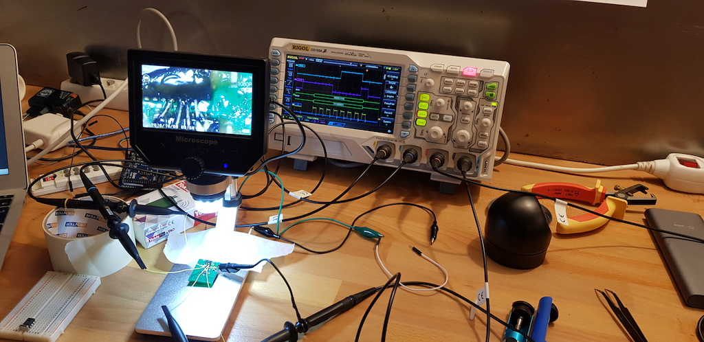
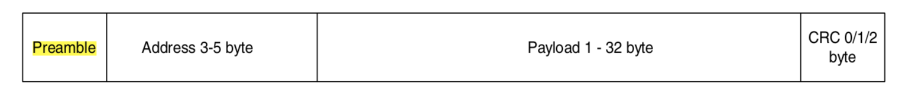

# Yokis devices - reverse engineering

It all started when I wanted to include my lights into my Home Automation. I wanted to be able to drive my lights from there like my other stuff.

## Devices presentation

Two different devices:
- MTV500ER - a 500 Watts dimmer
- MTR2000ER - a 2000 Watts switch

The protocol used to communicate ends to be very similar for the both devices. Good point !

To use the devices, follow the wiring diagrams from the Yokis website.

To control those devices remotely, you can use:
- an E2BP or E2BPP (those can be integrated behind your wall switches)
- a TLC4CP or TLC8CP

All remotes are working exactly the same !

Yokis uses 'pulses' (short presses) on buttons to configure their devices. It can be tedious but this is easy to emulate :) !

## First ideas

My first idea was to get information using an RF sniffer. NRF24L01 is quite challenging because no promiscuous mode is available. [Some workaround](http://travisgoodspeed.blogspot.com/2011/02/promiscuity-is-nrf24l01s-duty.html) exist and can be [used](http://yveaux.blogspot.com/2014/07/nrf24l01-sniffer-part-1.html) with success.
This seems promising but quite complex to use and I was not sure to succeed at all... Thanks to both of them, their work have inspired me a lot !

So long story short, if I want to communicate with another NRF24 device, I need the following information:
- the hardware address to connect to (and its length - 3 to 5 bytes)
- the channel the module operates on
- the speed rate
- the configuration used (CRC size, auto ack feature, Enhanced shockburst, etc.)

After several days of reading those respective blog entries and many [others](https://mmelchior.wordpress.com/2016/06/06/qc-360-a1-p1/), I decided to give a try for reading the SPI instead. Solders are **very very** small on those devices but I have good gears and it is worth a try !

I caught my microscope, my smallest soldering iron and a lot of patience to finish wiring things up to be able to sniff the SPI traffic.

I didn't have any logic analyser at that time so I boot up my oscilloscope and I began decoding the SPI right from the remote when a button is pressed...



I got the address (it appears to be 5 bytes long), the channel and all configuration for the device !
I have now everything I need to build a very simple NRF24 sniffer !

## First tries and fails

I couldn't make any use of the data I received from the sniffer, so I decided to study the "pairing" process instead because I wanted to see if this would be simpler to understand...

Looking at the SPI from the *remote* point of view, I got the following:
- Hardware address: `be be be be be`
- Channel: `0x02`
- RF configuration: `-12dB`
- `CRC`: 16 bits

I hooked an arduino up but I received nothing... To get packets, I had to disable CRC... Not sure yet why this happens but hey ! I have data flowing now !

```
ce24ff822e41b8dfbb4dad53c2fe2692a540bea80000000057d7d7d7d7d9a2e3
cf660b94d8027de4bdaadf5f0d779bfeca575ac0fea80000000057d7d7d7d7d9
ce24ff822e41bdee5edf7f1bd9ffc565b5207f50000000002bebebebebecf375
cf660b94d8027de4bb7bf9bdedd16bffc255aa603f54000000002bebebebebec
ce24ff822e41bdf77be9b52dd7ffd4975b497d4000000000afafafafafb3cdd7
cf660b94d8027de4bd6eaa5673bff3bfd12a4b603f54000000002bebebebebec
cc24ff824b393e6557fdca9526fa00048080aaa00000000057d7d7d7d7d9a2e3
cd660b94d8027eb4345b1ddd74f5513ea40100225550000000002bebebebebec
cc24ff824b393ae9a7597897577200000040aaa00000000057d7d7d7d7d9a2e3
cd660b94d8027eb43e7df3d7f776adffa92acb607f50000000002bebebebebec
```

Everything looks scrambled to me :/
Looking closely, it seems that there are a pattern at the end of each line. A bunch of zeros and repeated stuff.
Beginning of packets are quite similar:
- `ce24ff822e` and `cf660b94` are repeated.
- some bytes get my attention at the end of each packet: `d7d7d7d7d`, `bebebebe` or `fafafafaf`. `bebebebe` is quite familiar...

I came back to the datasheet and understood where the problem is... When I get data from the reading pipe, I get 32 bytes (the maximum possible) from it. The problem is that the device sends only several bytes. Doing a 32 bytes read, I probably get the next packet in the buffer. And what if I am getting the next bytes but *raw* ? By raw, I mean that I get what is received by the NRF24 module but unprocessed (with all the preamble, the header, the CRC and everything).

Let's look at the datasheet again. A data packet is like so:



| data     | length   | remarks                                                    |
|----------|----------|------------------------------------------------------------|
| preamble | 8 bits   | `01010101` or `10101010` which are either `0x55` or `0xAA` |
| address  | 5 bytes  | I know it's 5 bytes: `CC 17 CC 17 17`                      |
| payload  | ? bytes  | I am getting 32 bytes straight                             |
| CRC      | 16 bits  |                                                            |

So if I understand correctly, `payload` contains the actual payload and right after a new packet starting from the preamble.
The preamble is easy to guess: it is `0xAA` if address begins with a binary `1`, `0x55` otherwise. My address begins with `be` which is `10111110` in binary. I should then get `0xAA`. But I don't see any of that yet... Maybe the preamble is skipped by the hardware no matter what and I don't get it in the buffer ?

I also saw that if *enhanced shockburst* is enabled, there is a *9 bits control packet field* added. Wait... 9 bits... So if this header is present, every bytes is shifted by 1 bit as soon as this header is present (8 bits for 1 byte) :) !

Let's write some code to shift everything 9 bits left:

```
ce 24 ff 82 2e 41 b8 df bb 4d ad 53 c2 fe 26 92 a5 40 be a8 00 00 00 00 57 d7 d7 d7 d7 d9 a2 e3 => 49 ff 04 5c 83 71 bf 76 9b 5a a7 85 fc 4d 25 4a 81 7d 50 00 00 00 00 af af af af af b3 45 c6
cf 66 0b 94 d8 02 7d e4 bd aa df 5f 0d 77 9b fe ca 57 5a c0 fe a8 00 00 00 00 57 d7 d7 d7 d7 d9 => cc 17 29 b0 04 fb c9 7b 55 be be 1a ef 37 fd 94 ae b5 81 fd 50 00 00 00 00 af af af af af b2
ce 24 ff 82 2e 41 bd ee 5e df 7f 1b d9 ff c5 65 b5 20 7f 50 00 00 00 00 2b eb eb eb eb ec f3 75 => 49 ff 04 5c 83 7b dc bd be fe 37 b3 ff 8a cb 6a 40 fe a0 00 00 00 00 57 d7 d7 d7 d7 d9 e6 ea
cf 66 0b 94 d8 02 7d e4 bb 7b f9 bd ed d1 6b ff c2 55 aa 60 3f 54 00 00 00 00 2b eb eb eb eb ec => cc 17 29 b0 04 fb c9 76 f7 f3 7b db a2 d7 ff 84 ab 54 c0 7e a8 00 00 00 00 57 d7 d7 d7 d7 d8
ce 24 ff 82 2e 41 bd f7 7b e9 b5 2d d7 ff d4 97 5b 49 7d 40 00 00 00 00 af af af af af b3 cd d7 => 49 ff 04 5c 83 7b ee f7 d3 6a 5b af ff a9 2e b6 92 fa 80 00 00 00 01 5f 5f 5f 5f 5f 67 9b ae
cf 66 0b 94 d8 02 7d e4 bd 6e aa 56 73 bf f3 bf d1 2a 4b 60 3f 54 00 00 00 00 2b eb eb eb eb ec => cc 17 29 b0 04 fb c9 7a dd 54 ac e7 7f e7 7f a2 54 96 c0 7e a8 00 00 00 00 57 d7 d7 d7 d7 d8
cc 24 ff 82 4b 39 3e 65 57 fd ca 95 26 fa 00 04 80 80 aa a0 00 00 00 00 57 d7 d7 d7 d7 d9 a2 e3 => 49 ff 04 96 72 7c ca af fb 95 2a 4d f4 00 09 01 01 55 40 00 00 00 00 af af af af af b3 45 c6
cd 66 0b 94 d8 02 7e b4 34 5b 1d dd 74 f5 51 3e a4 01 00 22 55 50 00 00 00 00 2b eb eb eb eb ec => cc 17 29 b0 04 fd 68 68 b6 3b ba e9 ea a2 7d 48 02 00 44 aa a0 00 00 00 00 57 d7 d7 d7 d7 d8
cc 24 ff 82 4b 39 3a e9 a7 59 78 97 57 72 00 00 00 40 aa a0 00 00 00 00 57 d7 d7 d7 d7 d9 a2 e3 => 49 ff 04 96 72 75 d3 4e b2 f1 2e ae e4 00 00 00 81 55 40 00 00 00 00 af af af af af b3 45 c6
cd 66 0b 94 d8 02 7e b4 3e 7d f3 d7 f7 76 ad ff a9 2a cb 60 7f 50 00 00 00 00 2b eb eb eb eb ec => cc 17 29 b0 04 fd 68 7c fb e7 af ee ed 5b ff 52 55 96 c0 fe a0 00 00 00 00 57 d7 d7 d7 d7 d8
```

Some interesting stuff here:
- on the second line, I get `cc 17 29` which is the hardware address and the channel appearing on the payload (I sniffed that on my very first attempts) !
- on each line, the end repeated pattern is also repeating ( `eb eb eb eb` -> `d7 d7 d7 d7` -> `af af af af` -> `5f 5f 5f 5f`).

I was right, everything is coherent because shifted 1 bit left. I must have missed something in the protocol because I didn't see *Enhanced Shockburst* being enabled... Why don't I receive anything when CRC is enabled while I actually see this option on the SPI ?

## Pairing process

So far, I know :
- the address of the pairing process: `be be be be be`
- the channel: `0x02`
- `CRC` is `16 bits`
- `Enhanced Shockburst` feature must be enabled - everything is shifted by 1 bit (so the `9 bits` *packet control field* must be present in the payloads I see)

I bought a small *logic analyser* and my life become much easier :) With this little device, I was able to get new information when pairing (a longer capture time (several seconds) whereas my oscilloscope allowed me only 20 ms max or there are not enough samples to get correct readings plus it's tedious to use an Oscilloscope for that !):
- the remote receives 8 bytes from the device
  - 3 bytes firstly: `49 0 22`
  - 5 bytes secondly: `CC 17 29 B0 84`
  - `CRC`: 16 bits
  - `Auto acknowledgement` is enabled - via the `EN_AA` register - this one actually activates *Enhanced Shockburst* feature.

I hooked my Arduino up again with this in mind. This time I changed the NRF24's configuration such as `EN_AA` is enabled and the `CRC` is set to 16 bits. I configure the listen address to `be be be be be` on the channel `02` waiting for 3 bytes.
Bingo ! I received `49 0 22` :) I then added code to read the next 5 bytes and... nothing...

After poking around for several hours on this, I realized that the timing between the two reads is quite tricky to get. It has to be very quick to be able to read the second packet: the time needed to re-configure the NRF24 module to read the next 5 bytes is too long. The packet is already sent by the device and all the bytes are lost because never received on the remote side... But, beeing quick enough, it works !
To improve timing, I ended up making all NRF24's functions library public to be able to go low level on that particular read, writing directly to the registers myself...
It doesn't work each time but I get a fair amount of success ! Much later on, when I reversed the *on/off process*, I found a way to make all this very reliable but more on that later :p !

So what is the meaning of those packets:
- `49 00 22`: probably the hardware revision of the device (I am still not sure about that)
- `cc 17 29 b0 84`: contains the address to use (`cc 17` repeated like so ? `cc 17 cc 17 17`, `<b1><b2><b1><b2><b2>` ?), `29` is the channel to use for communication. `b0 84` could be the serial number or something like that. I still don't know what to do with that too.

With that, I can *pair* any devices and get communication information. When I know more about its language, I am ready to give orders !
I tested many devices around the house to get their information and I ended up discovering that it's possible to use the *copy button* described in the manual to get the same stuff but directly from any paired remote ! No need to get into the walls anymore to click on the connect button !
This process consists in pressing a remote's button for 3+ seconds and the paired information are sent from the remote itself. Neat !

## On / off (and dimmer)

### on / off

Same thing, plugged in to the SPI and dumping everything when a button is pressed.

After several data extract, I ended up with the following:


|    | Register       | Content                       | Remark |
|----|----------------|-------------------------------|--------|
| 1  | `FLUSH_TX`     |
| 2  | `W_TX_PAYLOAD` | `35 04 00 20 cc 17 06 00 00`  | 9 bytes:<br>- `35 04 00 20` -> push button<br>- `53 04 00 20` -> release button<br>- `cc 17` | ->  addr bytes<br>- `06` -> change each time (random ?) - not sure what it is for<br>- `00 00` / `02 00` -> on or off / button stay pressed|
| 3  | `W_REGISTER`   | `0x00101b = 0x05` - `RF_CH`     | `0x00101001b`       | Channel configuration = 0x29                                 |
| 4  | `W_REGISTER`   | `0x00110b = 0x06` - `RF_SETUP`  | `0x0 0 1 0 0 01 1b` | RF configuration = -12dB, no PLL_LOCK, 250kbps               |
| 5  | `W_REGISTER`   | `0x01010b = 0x0A` - `RX_ADDR_P0`| `0xcc17cc1717`      | Address on which to receive (datapipe 0)                     |
| 6  | `W_REGISTER`   | `0x10000b = 0x10` - `TX_ADDR`   | `0xcc17cc1717`      | Transmit address                                             |
| 7  | `W_REGISTER`   | `0x10001b = 0x11` - `RX_PW_P0`  | `0x00000010b`       | Number of bytes in RX payload                                |
| 8  | `W_REGISTER`   | `0x00010b = 0x02` - `EN_RXADDR` | `0x00000001b`       | Enable datapipe 0                                            |
| 9  | `W_REGISTER`   | `0x00001b = 0x01` - `EN_AA`     | `0x00000000b`       | DO NOT ENABLE AUTO ACKNOWLEDGMENT                            |
| 10 | `W_REGISTER`   | `0x00111b = 0x07` - `STATUS`    | `0x01110000b`       | Clear interrupt bits (RX, TX and retry)                      |
| 11 | `W_REGISTER`   | `0x00100b = 0x04` - `SETUP_RETR`| `0x00000000b`       | Re-Transmit disabled                                         |
| 12 | `W_REGISTER`   | `0x00000b = 0x00` - `CONFIG`    | `0x00001110b`       | Config PTX, powerup, 2 bytes CRC                             |
| 13 | 4.1 ms wait    |
| 14 | `FLUSH_RX`     |                                 |                     | Preparing for data reception                                 |
---
| | | | |
|----|----------------|-------------------------------|--------|
| 15 | `W_REGISTER`   | `0x00000b = 0x00` - `CONFIG`    | `0x00001110b`       | Config PTX, UP, 2B CRC (send payload via REUSE_TX_PAYLOAD ?) |
| 16 | `ce(high)` for 15us then low. |                  |                     | Effectively send TX                                          |
| 17 | 700us wait     |                                 |                     | Spend time to let the PL to be sent ?                        |
| 18 | `W_REGISTER`   | `0x00000b = 0x00` - `CONFIG`    | `0x00001111b`       | Config `PRX`, `POWER_UP`, 2 bytes `CRC` (put on RX mode, read status | and verify RX_DR ?) - board might use IRQ... |
| 19 | `ce(high)`     |
| 20 | `W_REGISTER`   | `0x00111b = 0x07` - `STATUS`    | `0x01110000b`       | Clear interrupt bits (no data arrived so clearing for next loop ?) |
| 21 | `REUSE_TX_PL`  |                                 |                     | Send repeatedly payload (resend auto for next loop)          |
| 22 | 1ms wait       |
| 23 | `ce(low)`      |
| Goto 15 until something is suddenly received on RX (RX flag is `1` on MISO) |
| 24 | `R_RX_PAYLOAD` | `0x01 0x00`                     |                     | `RX` from MISO (how can this be triggered ? IRQ ?) If I understand | well, payload is repeatedly sent (REUSE_TX_PL). When RX receive something, REUSE_TX_PL is stopped doing a FLUSH_TX (1st instruction ?) => | when sending payload 53 etc.,  the end of the loop must be different (have to stop `REUSE_TX_PAYLOAD`) |
| 25 | `W_REGISTER`   | `0x00111b = 0x07` - `STATUS`    | `0x01110000b` |
| 26 | 60ms wait |
| 27 | `W_REGISTER`   | `0x00000b = 0x00` - `CONFIG`    | `0x00001100b` | power down - go to sleep                                           |
| 28 | Repeat from beginning | Repeating with other PAYLOAD for TX and RX: TX = `53 04 00 20 cc 17 DA 00 00 RX` = `01 00`                    |


Looking at this and even if it took me several days to understand and a lot of tests, we can see that the device is most probably using `IRQ` pin to be able to exit from the loop. My first tests were not successfull because :
- it was very difficult to solder a new wire without poping another wire out to *see* `IRQ` pin...
- when I tested the `IRQ` pin, I did not have enough experience with NRF24 to understand what I did wrong in my code
- I had a lot of pain to understand the overall algorithm and `REUSE_TX_PAYLOAD`.
- Few people on the web uses `REUSE_TX_PAYLOAD` nor `IRQ` pin.

After digging and trying to mimic this algo with the *Maniacbug RF24* high level library, I decided to use low level stuff from it (I moved functions from private to public) to use functions such as `write_register` directly. Indeed, this library is intended to simplify your life as a developer but I needed more :)
After coding everything using [low level functions](src/RF/e2bp.cpp#L266) I began to have results :D
Now that I understand better, I tried to get back to the genuine NRF24 library without success yet...

The solution was indeed to use `IRQ` pin for receiving data on RX when it is available. If you don't use `IRQ`, it's almost impossible to get the response from the device... It's too slow to switch from `TX` to `RX` for listening and the device has already sent the response on the air...
The response says two things:
- you have to stop the `TX` loop
- you get the status of the device (last byte is 0 if OFF, 1 if ON - not so sure for dimmer but for switch it seems to be the case all the time)

If I sum up, to act as a remote, you need to:
- send a `35 04 00 20 <b1> <b2> <r1> 00 00` (`b1` and `b2` are the two bytes from the address, `r1` seems to be random - using `0` works as well...). This payload is sent when the button is pressed (and hold)
- wait until a payload is received (`00 00` or `00 01` for switches, `01 00` or `01 01` for dimmers)
- send a `53 04 00 20 <b1> <b2> <r1> 00 00` - this payload is sent when the button is released.
- wait until a payload is received

It's that simple, really !

### What about dimmers ?

To dim, when pressing the button more that 1 sec, a new payload is sent every seconds:
- `35 04 00 20 <b1> <b2> <r1> 02 00` - note the byte `02` at then end
- the device acknowledge by responding the usual bytes

When the button is released, the `53 ...` payload is sent as usual.

The same payloads are used for on, off or for dimming up or down.

## Last but not least

I tried many things with the payloads and it appears that if I use a wrong one, I get most of the time the device status in response !
It is very convenient to know without actually switching the light on or off !
To do that, I send the same payload but beginning by `00` instead of `35` or `53` and I wait for a response. The response contains the status.
See [this code](src/RF/e2bp.cpp#L247) for more information on how this is done.


I can now control all my devices from *Home Assistant*. Every device is polled every 3 to 5 seconds for status in case someone uses the physical switch (on the wall) and/or a Yokis remote.
Finally, this implementation is more reliable than the Yokis remotes because I can dim more accurately than manually pressing buttons, I can switch on or off a device and not just toggling it (I do get the status from the device) and more importantly, I can automate everything !

## Last notes

Work has still to be done. When I pair the same button with more than one device, the payload used is very different from the usual `35`/`53` couple.
I still didn't figure out how those bytes are computed.

Hopefully, this is not really useful as I can drive every single device independently but I would like to know for the sake of completeness :) !

A note for testers, if you appear to have paired two or more devices on a button, you can revert that by unpairing devices from the button (pair the device one more time to unpair). You also can reset the remote by short pressing 10 times a button and by issuing 25 presses. The remote should blink 3 or 4 times to acknowledge.
